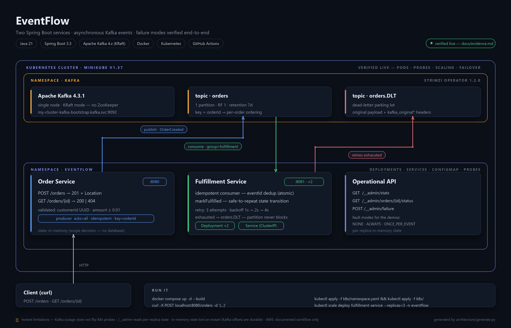

# EventFlow — Distributed Event-Driven Backend

[](https://github.com/Mr-Wolv/EventFlow_Bakr101_2026/actions/workflows/ci.yml)

**Java 25 | Spring Boot 3.5.16 | Apache Kafka | Docker | Kubernetes | GitHub Actions**

Two independently deployable Spring Boot services communicating through asynchronous
Kafka events. A deliberately small system built to demonstrate distributed-systems
fundamentals with reproducible evidence — not another CRUD app.

- **Order Service** accepts `POST /orders` and publishes an `OrderCreated` event.
- **Fulfillment Service** suppresses duplicate event IDs within its current process,
  retries transient failures with exponential backoff, and dead-letters poison records.

No frontend. No authentication. No database. Every scope decision is documented and
deliberate (see [Scope decisions](#scope-decisions)).

## Project status — what is verified vs. documented

This project makes a point of not claiming anything it cannot show. The honest split:

| Capability | Status |
|---|---|
| Build + 45 unit tests (core) + 12 unit tests (AWS Lambda, 100% line coverage) | ✅ **Verified, coverage-gated** — Java 25 `mvn -B verify` enforces ≥95% line coverage on both core modules; `mvn -f aws/lambda/pom.xml verify` enforces ≥90% on the Lambda (currently 100%). [docs/evidence.md](docs/evidence.md) preserves the earlier Java 21 / 19-test transcript |
| Docker Compose stack (Kafka 4.0 KRaft + topic init + both services) | ✅ **Java 25 smoke-tested** — all containers healthy; order reached `FULFILLED`; both APIs returned `415` for unsupported media types. Details in [docs/evidence.md](docs/evidence.md) §8 |
| Duplicate delivery, consumer downtime, retry + recovery, dead-letter topic | 🕰 **Verified live on Java 21; unit-verified on Java 25** — the end-to-end transcripts in [docs/evidence.md](docs/evidence.md) §§2–5 were captured on the Java 21 compose stack and have not been re-run end-to-end on Java 25; on Java 25 the same paths are covered by the 45-test suite (dedup, rollback + retry, exhaustion → DLT, async publish, error mapping) and by the happy-path runs in §8/§9 |
| Kubernetes on minikube + Strimzi Kafka | ✅ **Verified — Java 21 live run + Java 25 CI kind job** — deployed on 2026-09-29 (Minikube v1.39.0, in-cluster Strimzi Kafka) with scale-up, pod-kill failover and rebalance; on Java 25, CI deploys to kind and runs an in-cluster smoke test on every push. Transcripts: [docs/evidence.md](docs/evidence.md) §6, §9 |
| AWS EC2 deployment | 📝 **Documented only** — creating an AWS account requires a payment method, which is not available for this project. Full workflow in [docs/aws-deployment.md](docs/aws-deployment.md) |
| AWS serverless path (SQS → Lambda → DynamoDB + S3, Terraform) | ✅ **Verified locally via LocalStack** — `terraform plan/apply/destroy` executed, end-to-end event flow + durable idempotency proven by [aws/validate.sh](aws/validate.sh); captured in [docs/evidence.md](docs/evidence.md) §11. **No AWS account exists; nothing was deployed to AWS** — LocalStack emulates the AWS APIs locally and its token is not an AWS credential |
| CI | **Verified** — pushes and PRs targeting `main` run Maven verification, image builds, and a kind/Strimzi smoke test that deploys Java 25 images and fulfills a real order in-cluster. Current run status is shown by the [Actions page](https://github.com/Mr-Wolv/EventFlow_Bakr101_2026/actions) and the badge above. |

"Documented" is stated as such everywhere it applies; nothing in the docs pretends a
cloud resource was provisioned.

---

## Architecture



*The service topology: both services in `eventflow`, Kafka via Strimzi in `kafka`, and
process-local state. Toolchain and runtime versions shown in the diagram are from the
Java 21 live verification (2026-09-29); CI now builds and smoke-tests Java 25 images on
kind on every push (§9). Source: [`architecture/generate.py`](architecture/generate.py).*

Event published to the `orders` topic (keyed by `orderId` for per-order ordering):

```json
{
  "eventId": "c7a8f3b2-...",
  "eventType": "OrderCreated",
  "orderId": "d4e5f6a7-...",
  "customerId": "550e8400-...",
  "amount": 125.50,
  "occurredAt": "2026-09-29T10:00:00Z"
}
```

---

## Quick start (Docker Compose)

Requires Docker 24+ and Docker Compose v2. Kafka runs in **KRaft mode** (no ZooKeeper).

```bash
docker compose up -d --build
docker compose ps   # wait until kafka, order-service and fulfillment-service show (healthy)
# (the kafka-init container creates the `orders` topic and exits — exit 0 is expected)

# create an order
curl -s -X POST http://localhost:8080/orders \
  -H "Content-Type: application/json" \
  -d '{"customerId": "550e8400-e29b-41d4-a716-446655440000", "amount": 125.50}'

# watch it flow: OrderCreated → Kafka → Fulfillment
docker compose logs -f order-service fulfillment-service
# [PUBLISHED]  event ... -> orders-0@0
# [PROCESSING] order ... amount 125.50 (from orders)
# [FULFILLED]  order ...
```

### Run without Docker (local JVMs)

Requires JDK 25 and a Kafka broker on `localhost:9092` (for example the single node
from the [Apache Kafka quickstart](https://kafka.apache.org/quickstart)).

```bash
mvn -B -DskipTests package
java -jar order-service/target/order-service-1.0.0.jar
java -jar fulfillment-service/target/fulfillment-service-1.0.0.jar
```

Both default to `KAFKA_BOOTSTRAP_SERVERS=localhost:9092` and topic `orders`; override
with the `KAFKA_BOOTSTRAP_SERVERS` and `KAFKA_TOPIC` environment variables.

---

## The four demonstrations

Full transcripts: [docs/evidence.md](docs/evidence.md). Repro steps: [docs/failure-scenarios.md](docs/failure-scenarios.md).

| Scenario | Mechanism | Expected result |
|----------|-----------|-----------------|
| **Duplicate event delivery** | Same `eventId` delivered twice (manual redelivery) | `[DUPLICATE] ... skipping` while the consumer's in-memory dedup set survives |
| **Consumer downtime** | Stop fulfillment, create order, restart | Kafka retains the event; processed on restart (`auto.offset.reset: earliest`) |
| **Partial failure → retry → recovery** | Arm `ONCE_PER_EVENT` fault; processing throws after receipt | Up to 3 retries after initial delivery (1s/2s/4s), then success and fulfillment |
| **Retry exhaustion → dead-letter** | Arm `ALWAYS` fault | After 3 retries (4 delivery attempts total), record goes to `orders.DLT`; processing continues |

The duplicate-delivery demo needs the same `eventId` twice — `POST /orders` always
creates a *new* event, so the demo produces the original event record directly to the
topic using `kafka-console-producer` (commands in the docs).

Failure injection is a first-class feature (`POST /__admin/failure`), which makes every
scenario reproducible on demand instead of "try to kill it mid-flight and hope".

---

## How it works

**Write path (Order Service).** `POST /orders` is validated (`customerId` UUID,
`amount` ≥ 0.01), the order is stored, and an `OrderCreated` event — with a fresh
`eventId` — is sent to the `orders` topic, keyed by `orderId` so all events for one
order keep their order. The producer is idempotent with `acks=all`; the HTTP response
returns immediately with `201` and does **not** wait for the broker or the consumer.
That decoupling is what makes the system eventually consistent.

**Consume path (Fulfillment Service).** The listener checks the event's `eventId`
against a process-local dedup set (atomic check-and-record), so a redelivered event is
skipped while that process is alive. New events pass through a failure-injection point (for the demos), then
mark the order `FULFILLED` — a safe-to-repeat state transition. A thrown exception is
retried in-process up to three times after the initial delivery, with exponential
backoff (1s, 2s, 4s); records that keep failing are published to `orders.DLT` with
their original payload and failure headers, and the partition moves on.

The full step-by-step processing contract — including what state survives a crash at
each point — is in [docs/audit-trail.md](docs/audit-trail.md), and the guarantee
analysis in [docs/distributed-systems.md](docs/distributed-systems.md).

---

## API

### Order Service (`:8080`)

| Method | Path | Description |
|--------|------|-------------|
| POST | `/orders` | Create order → `201 Created` + `Location` header. Validated (`customerId` UUID, `amount` ≥ 0.01). |
| GET | `/orders/{id}` | Fetch order → `200` or `404`. |
| GET | `/actuator/health` | Health (readiness/liveness groups enabled for K8s probes). |

### Fulfillment Service (`:8081`)

| Method | Path | Description |
|--------|------|-------------|
| GET | `/__admin/stats` | Unique events processed, orders fulfilled, injected failures, current fault mode. |
| GET | `/__admin/orders/{orderId}/status` | `PENDING` or `FULFILLED` for a given order. |
| POST | `/__admin/failure` | Arm a fault: `{"fault": "NONE" \| "ALWAYS" \| "ONCE_PER_EVENT"}`. |
| GET | `/__admin/failure` | Show the currently armed fault mode and injected-failure count. |
| POST | `/__admin/failure/clear` | Reset fault mode to `NONE`. |
| GET | `/actuator/health` | Health. |

**Error semantics (both services):** consistent JSON errors — `400` with a message on
bad input (invalid enum values are echoed back with the accepted list), `404` for
unknown routes or unknown order ids, `405` for a wrong HTTP method, `415` for a wrong
Content-Type, `500` only for genuine unexpected failures. Verified per-case in
[docs/evidence.md](docs/evidence.md) §7.

---

## Tests

```bash
mvn -B verify
```

45 unit tests across the two core modules, including atomic event-ID deduplication under a
16-thread race, duplicate delivery skipping, failure injection with idempotency-record
rollback, retry recovery, asynchronous publish callbacks, error mapping, and Kafka
error-handler configuration. The AWS Lambda module adds 12 more (conditional-put
idempotency, archive keying, poison-message and at-least-once rethrow contract), and
both builds fail below their line-coverage gates (95% core / 90% Lambda) — coverage is
enforced by the build, not a report.

**Toolchain:** the build targets Java 25 (`java.version=25` in the root [pom](pom.xml));
compiling under an older JDK produces a wall of errors. On Windows with multiple JDKs,
point `JAVA_HOME` at the JDK 25 install before running Maven. The committed
[.vscode/settings.json](.vscode/settings.json) pins the VS Code Java language server to
the same JDK so IDE analysis matches the build.

---

## Kubernetes

Manifests live in [`k8s/`](k8s/) — Namespace, ConfigMap, two Deployments (readiness +
liveness probes, resource requests/limits), two ClusterIP Services, and the Strimzi
`KafkaTopic` CR for the `orders` topic. Fulfillment runs **2 replicas**; with the demo's
single partition, only one replica consumes at a time. This setup was deployed and
verified on Minikube with Java 21 on 2026-09-29, and CI runs the same manifests on
kind with Java 25 on every push (§9); transcripts in [docs/evidence.md](docs/evidence.md) §6.

```bash
kubectl apply -f k8s/namespace.yaml   # first — see note in docs/kubernetes.md
kubectl apply -f k8s/
kubectl get pods -n eventflow
kubectl scale deployment fulfillment-service --replicas=3 -n eventflow
```

Details, including running Kafka in-cluster with Strimzi: [docs/kubernetes.md](docs/kubernetes.md).

## AWS

The EC2 deployment workflow (single instance, Docker Compose, security group, teardown)
is documented in [docs/aws-deployment.md](docs/aws-deployment.md). **Documented only:**
creating an AWS account requires a payment method at sign-up, which was not available
for this project — no instance was ever launched, and the docs say so explicitly.

## CI

[.github/workflows/ci.yml](.github/workflows/ci.yml) — two jobs on every push:

1. **Build, test, Docker images** — JDK 25 (Temurin) with Maven caching, `mvn -B verify`
  (45 unit tests, coverage-gated ≥95% line) plus the coverage-gated AWS Lambda module
  (12 tests, ≥90% line), then `docker compose build` for both service images.
2. **Kubernetes (kind)** — builds the images, boots a kind cluster, deploys the Strimzi
   operator + single-node Kafka, applies [`k8s/`](k8s/), then smoke-tests the real
   in-cluster flow: `POST /orders` → consumed → `FULFILLED` (polls up to 60s, fails the
  job otherwise). This CI job checks the happy path only; it does not repeat the
  manual scaling and pod-failover scenarios in the historical [docs/evidence.md](docs/evidence.md) §6.

---

## Project structure

```
EventFlow/
├── pom.xml                             # Multi-module root (Spring Boot 3.5 parent)
├── architecture/
│   ├── architecture.png                # System diagram (rendered)
│   └── generate.py                     # Diagram source — python architecture/generate.py
├── docker-compose.yml                  # KRaft Kafka + topic init + both services
├── order-service/
│   ├── Dockerfile                      # Multi-stage, dependency-layer cached
│   └── src/main/java/com/eventflow/order/
│       ├── OrderApplication.java
│       ├── OrderController.java        # POST/GET /orders, 201+Location, 404
│       ├── OrderService.java           # save → publish
│       ├── OrderRepository.java        # In-memory store (scope decision)
│       ├── EventPublisher.java         # KafkaTemplate, orderId key, delivery callback
│       ├── OrderCreatedEvent.java      # Event record (ISO-8601 timestamp)
│       ├── OrderRequest.java           # Validated request DTO
│       ├── Order.java                  # Aggregate
│       └── GlobalExceptionHandler.java # Consistent JSON errors
├── fulfillment-service/
│   ├── Dockerfile
│   └── src/main/java/com/eventflow/fulfillment/
│       ├── FulfillmentApplication.java
│       ├── FulfillmentConsumer.java    # @KafkaListener: idempotency → inject → fulfill
│       ├── IdempotentConsumer.java     # Atomic eventId dedup set
│       ├── FailureInjector.java        # NONE / ALWAYS / ONCE_PER_EVENT faults
│       ├── KafkaErrorConfig.java       # Backoff retry + DeadLetterPublishingRecoverer
│       ├── AdminController.java        # /__admin stats + fault control
│       ├── ErrorExceptionHandler.java  # Same error shape as order-service; enum errors self-document
│       ├── OrderFulfillmentStore.java  # In-memory state
│       ├── OrderStatus.java            # PENDING / FULFILLED
│       └── OrderCreatedEvent.java      # Consumer-owned event copy
├── k8s/                                # namespace, configmap, deployments, services, Strimzi KafkaTopic
├── aws/                                # AWS path (LocalStack-validated variant) — see aws/README.md
│   ├── lambda/                         # Java 21 fulfillment Lambda (standalone Maven build, shaded jar)
│   ├── terraform/                      # S3, DynamoDB, SQS, IAM, Lambda, event-source mapping
│   └── validate.sh                     # automated integration test: send → assert → duplicate-proof
├── docs/
│   ├── evidence.md                     # Captured transcripts of every demo
│   ├── distributed-systems.md          # Guarantees and tradeoffs
│   ├── failure-scenarios.md            # Step-by-step repro commands
│   ├── kubernetes.md                   # Deploy + scale guide
│   ├── aws-deployment.md               # EC2 workflow (documented only)
│   ├── aws-architecture.md             # AWS variant vs Kafka path — guarantees compared
│   ├── local-aws-validation.md         # LocalStack validation with captured output
│   └── audit-trail.md                  # Processing contract walkthrough
└── .github/workflows/ci.yml
```

## Technologies

| Layer | Technology |
|-------|-----------|
| Language | Java 25 |
| Framework | Spring Boot 3.5.16 (Web, Validation, Actuator, Spring Kafka) |
| Messaging | Apache Kafka 4.x in KRaft mode — Compose runs 4.0; Java 21-era service images were also exercised against Strimzi Kafka 4.3.1 |
| Containerization | Docker (multi-stage builds) |
| Orchestration | Kubernetes (Deployments, Services, ConfigMaps, probes) |
| CI | GitHub Actions |
| Cloud (documented) | AWS EC2 workflow |
| AWS path (LocalStack-validated) | Terraform, SQS, Lambda (Java 21), DynamoDB, S3 — validated against LocalStack with `ENFORCE_IAM=1`; no AWS account used |

## Scope decisions

Deliberate limitations, each with a documented production upgrade path in
[docs/audit-trail.md](docs/audit-trail.md):

- **In-memory state** — no database; an Order Service restart loses orders. Production:
  PostgreSQL + JPA, or the event-sourced path.
- **Process-local idempotency** — duplicate event IDs are suppressed only while the
  consumer process retains its in-memory set; it does not survive restarts or span
  replicas. Fulfillment's state transition is safe to repeat. Production: durable
  processed-events store (DB unique constraint / Redis) or a processed-events topic.
- **Broker persistence** — Docker Compose does not mount a persistent volume for Kafka;
  recreating the broker loses its records and offsets. Persistent K8s broker storage is
  determined by the Strimzi Kafka configuration, not by the service manifests here.
- **Single-partition topic** — with one partition only one consumer replica receives
  records. Production: partition the topic by `orderId`.
- **Fire-and-forget publishing** — delivery is confirmed via logged callbacks, not
  transactional with the save. Production: transactional outbox.
- **No auth, no tracing, no schema registry** — out of scope by design.
- **Per-instance observability endpoints** — `/__admin/stats` and the order-status
  endpoint read local in-memory state, so behind a load-balanced Service they may hit a
  replica that did not process a given event (observed during the K8s run: a stats query
  via Service DNS returned zero on the replica without the partition). Demo queries target
  a specific pod; production needs shared state.

The point of this repository is architecture and failure-mode reasoning, and each demo
in [docs/evidence.md](docs/evidence.md) is a captured, real terminal transcript.
